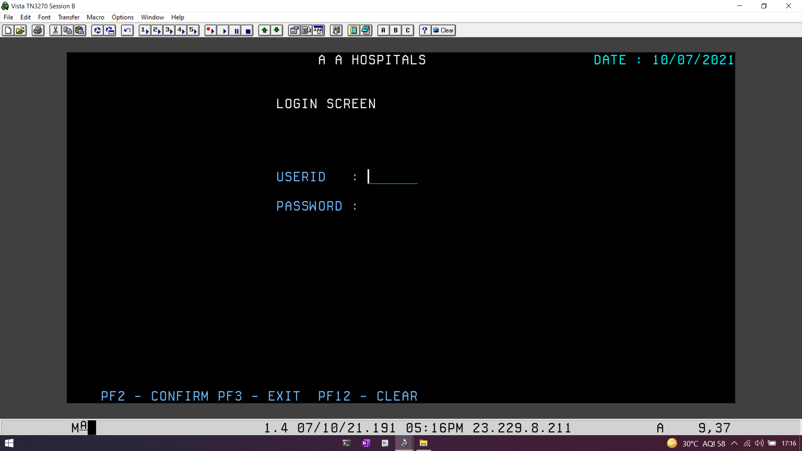
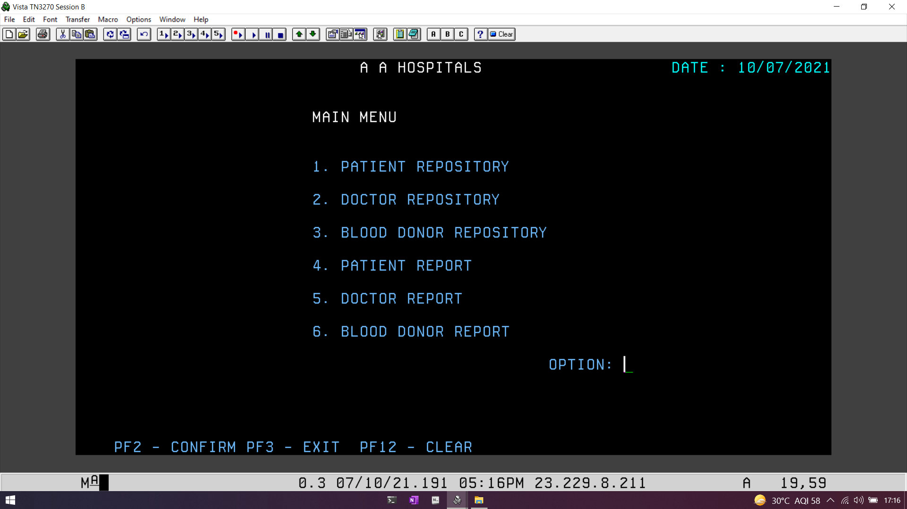
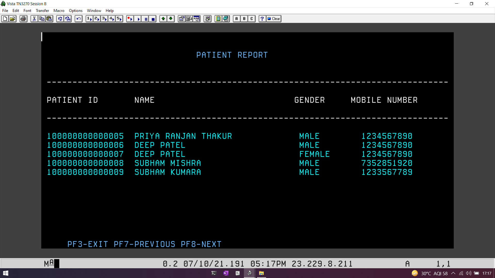
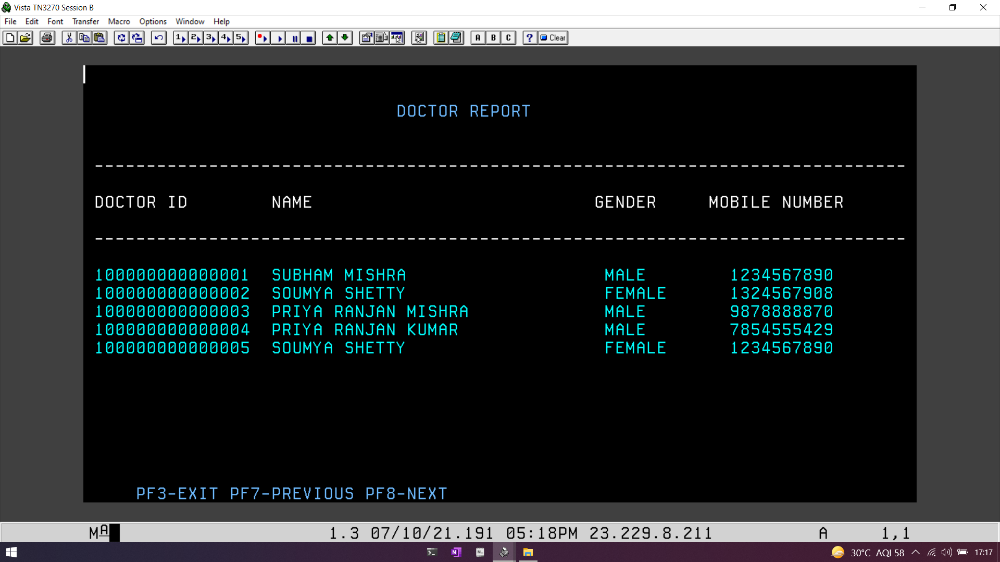
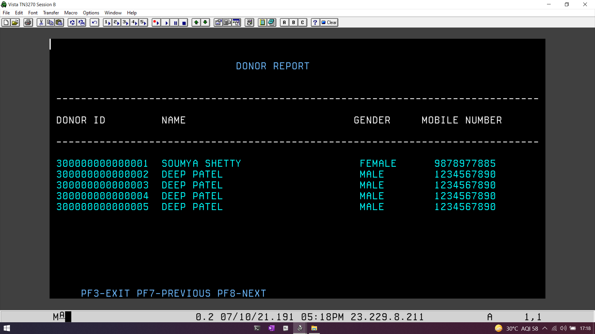

# Hospital Repository System

## Overview

The **Hospital Repository System** is a comprehensive software solution built using COBOL, CICS, DB2, and JCL, designed to manage and maintain essential information within a hospital setting. This system provides a reliable and efficient way to store and retrieve patient, doctor, and donor details, as well as generate reports for various stakeholders.

## Features

- **Patient Management**: Store and manage patient information, including personal details, medical history, and treatment records.

- **Doctor Management**: Maintain records of all doctors, their specializations, schedules, and patient assignments.

- **Donor Management**: Keep track of blood and organ donors, their eligibility, and donations made.

- **Report Generation**: Generate various reports for hospital administration, doctors, and other staff, including patient records, appointment schedules, and donation statistics.

- **User-Friendly Interface**: The system offers an intuitive user interface for easy data entry and retrieval, making it accessible to both technical and non-technical staff.

## Technologies Used

- **COBOL**: The primary programming language used for developing the core logic and functionalities of the system.

- **CICS (Customer Information Control System)**: Used for handling online transactions, ensuring real-time access and updates to the database.

- **DB2**: Serves as the relational database management system (RDBMS) to store and manage all hospital-related data.

- **JCL (Job Control Language)**: Used for batch processing, scheduling, and managing various system jobs and reports.

## System Requirements

To run the Hospital Repository System, you will need the following:

- A mainframe or server environment that supports COBOL, CICS, DB2, and JCL.

- IBM DB2 installed and configured for data storage.

- CICS environment set up to handle online transactions.

- Proper security measures to protect sensitive patient and donor data.

## Installation

1. Clone the repository to your mainframe or server environment.

2. Compile and link the COBOL source code using your preferred COBOL compiler.

3. Set up the DB2 database with the required tables and schemas as defined in the system's data model.

4. Configure the CICS environment to handle online transactions.

5. Create and schedule JCL jobs for batch processing and report generation.

6. Implement security measures to protect the system and data.

## Usage

1. Launch the Hospital Repository System.
   

2. Use the user-friendly interface to add, update, or retrieve patient, doctor, and donor information.
   
3. Generate reports as needed by specifying the report type and parameters.
   
   
   
4. Ensure proper backup and data recovery procedures are in place to safeguard critical data.

## Contribution

Contributions to the Hospital Repository System are welcome. If you'd like to contribute, please follow these steps:

1. Fork the repository.

2. Create a new branch for your feature or bug fix.

3. Make your changes and submit a pull request with a detailed description.

4. Ensure your code follows coding standards and is well-documented.

## License

This project is licensed under the [MIT License](LICENSE).
